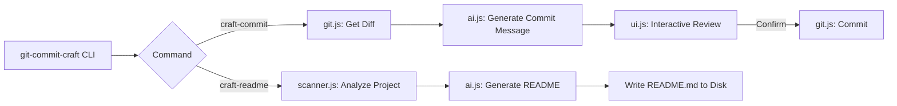

<div align="center">

# 🛠️ git-commit-craft

### AI-Powered Conventional Commits & README Generation, Right From Your Terminal

[](https://opensource.org/licenses/MIT)
[](https://nodejs.org)
[](https://aistudio.google.com)
[]()
[]()

*Clean commit histories and polished documentation, without the manual overhead.*

[Installation](#-installation) • [Configuration](#-configuration) • [Usage](#-usage--commands) • [Architecture](#-project-structure)

</div>

---

## 🧭 Table of Contents

1. [Overview](#-overview)
2. [Features](#-features)
3. [Tech Stack](#-tech-stack)
4. [Project Structure](#-project-structure)
5. [Installation](#-installation)
6. [Configuration](#-configuration)
7. [Usage & Commands](#-usage--commands)
8. [How It Works](#-how-it-works)
9. [Contributing](#-contributing)
10. [License](#-license)

---

## 🧠 Overview

`git-commit-craft` is a production-ready CLI tool built on **Node.js ESM** that uses **Google's Gemini 3.5 Flash** model to automate two of the most tedious parts of software development:

- ✅ Writing structured, standards-compliant **Conventional Commit** messages from your `git diff`
- ✅ Generating comprehensive, professional **README.md** files from your project's structure and metadata

No more staring at a blank commit prompt or a blank README file.

---

## 🚀 Features

| | |
|---|---|
| 🤖 **AI-Generated Commits** | Analyzes staged (or unstaged) `git diff` output and produces a fully compliant Conventional Commit message |
| 🔄 **Interactive Commit Workflow** | Accept, edit, regenerate, or cancel the AI-suggested commit directly from the terminal |
| 📄 **Smart README Generation** | Scans your directory tree, detected language, and `package.json` to draft a complete README |
| 🔐 **Secure Config Management** | Caches your Gemini API key locally at `~/.git-commit-craft/config.json`, or reads it from `GEMINI_API_KEY` |
| 🎨 **Polished Terminal UX** | Custom-rendered boxes, spinners, and color-coded success/warning/error indicators |
| 🧩 **Zero Native Dependencies** | Built entirely on lightweight, well-maintained npm packages |

---

## 🧰 Tech Stack

| Category | Technology |
|---|---|
| Runtime | Node.js `>=18.0.0` (ESM) |
| AI Engine | [`@google/generative-ai`](https://www.npmjs.com/package/@google/generative-ai) — Gemini 3.5 Flash |
| CLI Framework | [`commander`](https://www.npmjs.com/package/commander) |
| Interactive Prompts | [`inquirer`](https://www.npmjs.com/package/inquirer) |
| Terminal Spinners | [`ora`](https://www.npmjs.com/package/ora) |
| Terminal Styling | [`chalk`](https://www.npmjs.com/package/chalk) |

---

## 📂 Project Structure

```text
git-commit-craft/
├── package.json
└── src/
    ├── cli.js
    ├── config.js
    ├── ai.js
    ├── git.js
    ├── scanner.js
    └── ui.js
```

| File | Responsibility |
|---|---|
| `src/cli.js` | CLI entry point — defines `craft-commit` and `craft-readme` commands |
| `src/config.js` | Secure API key storage and retrieval (env var or local config file) |
| `src/ai.js` | Gemini prompt engineering and generation pipeline |
| `src/git.js` | Native Git operations — diffing and committing |
| `src/scanner.js` | Project directory analysis, language detection, `package.json` parsing |
| `src/ui.js` | Terminal rendering — boxes, spinners, and status messages |



---

## ⚙️ Installation

### From Source (Local Development)

```bash
git clone https://github.com/pegasusdev18/git-commit-craft.git
cd git-commit-craft
npm install
npm link
```

Once linked, the `git-commit-craft` command becomes available globally from **any** Git repository on your machine.

### Unlinking

```bash
npm unlink -g git-commit-craft
```

---

## 🔑 Configuration

You'll need a free **Gemini API Key** from [Google AI Studio](https://aistudio.google.com/app/apikey).

### Option 1 — Interactive Prompt

Run any command below and the tool will securely prompt you for the key on first use, saving it locally at:

```text
~/.git-commit-craft/config.json
```

### Option 2 — Environment Variable

```bash
export GEMINI_API_KEY="your_actual_api_key_here"
```

> 🔒 The `GEMINI_API_KEY` environment variable always takes priority over the locally cached config file.

---

## 💻 Usage & Commands

| Command | Description |
|---|---|
| `git-commit-craft craft-commit` | Analyzes staged changes and guides you through an interactive AI-assisted commit |
| `git-commit-craft craft-readme` | Scans the project directory and generates a complete `README.md` file |

### Example: Crafting a Commit

```bash
git add .
git-commit-craft craft-commit
```

```text
✔ Commit message generated.

┌──────────────────────────────────────────────┐
│ Generated Commit Message                      │
├──────────────────────────────────────────────┤
│ feat(auth): add JWT-based session validation  │
│                                                │
│ - Implement token verification middleware     │
│ - Attach decoded user to socket session       │
└──────────────────────────────────────────────┘

? Do you want to commit with this message?
  ❯ Yes, commit now
    Edit message
    Regenerate message
    Cancel
```

If no staged changes exist, the CLI will offer to analyze **unstaged** changes instead.

### Example: Generating a README

```bash
git-commit-craft craft-readme
```

```text
✔ Project structure scanned.
✔ README.md generated successfully.
✔ Saved to /path/to/project/README.md
```

If a `README.md` already exists in the current directory, you'll be prompted before it's overwritten.

---

## 🔬 How It Works

### Commit Generation Pipeline

1. Reads `git diff --cached` (falls back to `git diff` if nothing is staged).
2. Sends the diff to Gemini 3.5 Flash with a strict system prompt enforcing the [Conventional Commits v1.0.0](https://www.conventionalcommits.org/) specification.
3. Strips any accidental code fences from the model's response.
4. Presents the result in an interactive review loop — accept, edit, regenerate, or cancel.
5. On confirmation, runs `git commit -m "<message>"` natively.

### README Generation Pipeline

1. Recursively scans the project directory (up to a bounded depth, skipping `node_modules`, `.git`, `dist`, etc.).
2. Detects the dominant programming language by counting file extensions.
3. Parses `package.json`, if present, for name, dependencies, and scripts.
4. Sends this metadata to Gemini with a system prompt tailored for professional README generation.
5. Writes the raw Markdown response directly to `README.md`.

---

## 🤝 Contributing

Contributions are welcome and appreciated.

1. Fork the repository
2. Create a feature branch — `git checkout -b feature/amazing-feature`
3. Commit your changes — `git-commit-craft craft-commit`
4. Push the branch — `git push origin feature/amazing-feature`
5. Open a Pull Request

---

## 📄 License

This project is licensed under the **MIT License** — see the [LICENSE](LICENSE) file for details.

---

<div align="center">

⭐ **If this tool saves you time, consider giving it a star!** ⭐

</div>
